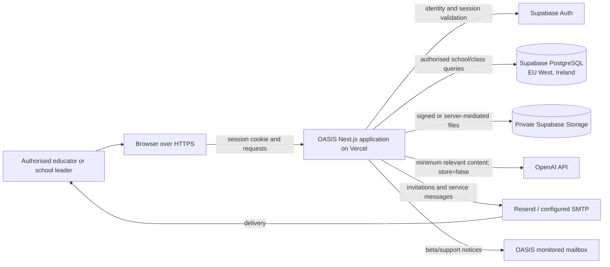

# Architecture and data flow

Last verified against the repository: 10 September 2026

## Purpose and boundaries

OASIS is a web application for authorised educators and school leaders. Children
do not sign in. Educators record observations, attach optional photographic
evidence, review AI-supported drafts, configure school frameworks and invite
colleagues. The school remains responsible for educational decisions.

The service boundary includes the OASIS Next.js application, its server routes,
Supabase project, OpenAI API calls and transactional/support email. A user's
browser, school devices, school networks and any information copied out of OASIS
are outside the managed service boundary.

## Logical architecture

The Supabase project is configured in `eu-west-1` (Ireland). The account-specific
processing locations and transfer mechanisms for Vercel, OpenAI, Resend and their
subprocessors must be confirmed from the executed provider agreements; they must
not be inferred from this diagram.

## Principal data flows

### 1. Authentication and access

1. The user signs in through Supabase Auth.
2. The application validates the user on the server before protected work.
3. School membership, role and current class/workspace are resolved.
4. Database row-level policies and server checks restrict reads and writes to the
   authorised school and class.
5. School owners control administrator grants. OASIS platform administration is
   separate and requires a verified MFA session.

### 2. Observation and AI-supported analysis

1. An educator enters an observation under a learner's initials/ID and optional
   birth-month context.
2. The application replaces known learner names with initials before the analysis
   request and does not include a full birth date.
3. The relevant observation and framework context is sent to the OpenAI Responses
   API with `store: false`.
4. OpenAI returns a draft. OASIS stores the saved observation and educator-reviewed
   result in Supabase.
5. The educator may edit or reject the draft; OASIS does not make a solely
   automated high-impact decision about the child.

`store: false` prevents creation of Responses application history. It does not by
itself remove default abuse-monitoring retention. OpenAI's [current API data
controls](https://platform.openai.com/docs/models/default-usage-policies-by-endpoint)
state that abuse-monitoring logs may contain customer content and are retained for
up to 30 days by default unless approved data controls apply.

### 3. Evidence photographs

1. The browser sends an allowed image type, up to 8 MB, to an authenticated server
   route.
2. The server stores it in the private `observation-evidence` bucket under the
   school and workspace path.
3. Retrieval is server-mediated after membership/path checks.
4. Deleting the associated observation also requests deletion of its photo.

Observation photos are persistent school content. They require their own backup,
retention and deletion controls because Supabase database backups do not include
Storage objects.

### 4. Framework import

1. A school administrator requests a signed upload URL.
2. The browser uploads a validated file to the private `framework-uploads` bucket.
3. The server downloads and immediately removes the temporary object, then extracts
   its text and maps the framework. A failed client flow also requests cleanup.
4. A fallback cleanup removes uploads older than 24 hours for that school when a
   new upload is prepared.

Only the resulting structured framework is intended to persist. The 24-hour
cleanup is opportunistic, not a scheduled lifecycle rule, and should be replaced
or backed by provider-side lifecycle automation before scale.

### 5. Invitations and service email

- Team and beta invitations use Supabase Auth invitation functions; branded email
  is delivered through the configured SMTP service (Resend).
- Beta-access and framework-support messages are also sent to the configured OASIS
  support mailbox through SMTP. Support attachments can contain school content and
  therefore must be minimised and handled under the mailbox retention policy.
- Invitation and security actions record identifiers and outcomes in the OASIS
  audit table without observation text or learner names.

## Trust boundaries and controls

| Boundary | Main risk | Current controls | Remaining evidence/action |
| --- | --- | --- | --- |
| Browser → OASIS | session theft, forged requests, unsafe input | HTTPS, secure session handling, origin checks on sensitive public form, validation, security headers | external penetration test; verify production headers after each change |
| OASIS → Supabase | privileged key exposure, cross-tenant access | server-only service key, RLS, membership checks, secret scanner | production migration proof; rotate and record key owners |
| OASIS → OpenAI | excessive learner content, retention, inaccurate output | minimisation, initials, `store: false`, human review | execute DPA; assess/obtain ZDR or Modified Abuse Monitoring |
| OASIS → email | disclosure to wrong recipient, spoofing, mailbox retention | verified sending domain, scoped transactional content | verify SPF/DKIM/DMARC evidence; mailbox access and retention review |
| Provider operations | outage, regional/third-country processing | provider terms and technical controls | executed DPAs, transfer assessment, backups, alerting and BCP test |

## System data stores

- Supabase Auth: user identity, credentials/session and authentication audit data.
- Supabase PostgreSQL: school, membership, class, learner, observation, framework,
  baseline, invitation, beta-access and security-event records.
- Supabase Storage: persistent observation photographs and temporary framework
  uploads.
- Provider operational logs: request, delivery, authentication and security
  metadata according to each provider's contracted settings and retention.
- OASIS support mailbox: support/beta messages and attachments until deleted under
  the approved mailbox schedule.
